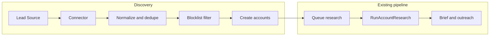

# Phase 2: Account Discovery

## Goal and overview

Phase 1 delivers **research + scoring**. Phase 2 adds **discovery** — getting new accounts into the system without manually uploading them.

Discovery flows into the existing research pipeline: candidate domains are normalised, deduped, filtered by blocklist, turned into accounts, and research is queued. Daily account limits and AI budget (from Phase 1) continue to apply.

---

## Data model

### lead_sources

| Column | Type | Notes |
|--------|------|--------|
| id | bigint PK | |
| user_id | FK users | |
| name | string | Display name |
| type | enum | search_query_pack, registry, directory, rss |
| config | JSON | Queries, API key env name, filters, result limits |
| cadence | enum | manual, daily, weekly |
| status | enum | enabled, disabled |
| last_run_at | timestamp nullable | |
| last_run_status | string nullable | success, failed, partial |
| last_run_domains_found | int nullable | For UI |
| timestamps | | |

### Account provenance (extend accounts table)

Add via migration (nullable for existing rows):

| Column | Type | Notes |
|--------|------|--------|
| lead_source_id | FK lead_sources nullable | Set when account created from discovery |
| discovered_at | timestamp nullable | When the domain was first discovered |
| discovery_metadata | JSON nullable | e.g. {"query": "...", "result_position": 3} |

This gives "this lead came from X query on Y date" without changing the research pipeline.

### lead_source_runs (required for Phase 2a)

History is needed for debugging (provider junk, blocklist too aggressive, rate limits, comparing query packs). `lead_sources.last_run_*` is a denormalised "latest" snapshot for quick UI.

| Column | Type | Notes |
|--------|------|--------|
| id | bigint PK | |
| lead_source_id | FK lead_sources | |
| trigger | enum | manual, scheduled |
| provider | string | e.g. bing, google_cse |
| config_snapshot | JSON | Config used at run time (edits don't change history) |
| started_at | timestamp | |
| completed_at | timestamp nullable | |
| status | enum | running, success, failed, partial |
| queries_executed | int | |
| throttled_count | int | |
| domains_found | int | |
| domains_created | int | |
| domains_skipped | int | Already existed |
| domains_blocked | int | Blocklist |
| error_message | text nullable | |
| query_errors | JSON nullable | Query-level failures |
| timestamps | | |

### discovery_candidates (two-phase ingest)

Run creates candidate rows; if approve disabled → auto-approve and promote to accounts; if approve enabled → user selects candidates to import. Gives preview, explainability, and "why blocked/skipped".

| Column | Type | Notes |
|--------|------|--------|
| id | bigint PK | |
| lead_source_run_id | FK lead_source_runs | |
| domain | string | Normalised |
| url | string | Canonical URL at discovery |
| title | string nullable | e.g. from snippet |
| snippet | text nullable | |
| status | enum | new, approved, rejected, blocked, duplicate, unreachable |
| reason | text nullable | Why blocked/skipped/unreachable |
| timestamps | | |
| Indexes | | domain, lead_source_run_id |

---

## Discovery pipeline

Steps executed by the ingestion job:

1. **Fetch** — Run the connector for the lead source (e.g. call search API for each query in a query pack).
2. **Extract domains** — Connector returns `DiscoveryRunResult` (see Provider connector contract); extract candidate URLs from `items[]`; normalise to domain per domain normalisation rules above.
3. **Dedupe** — Per run, dedupe by domain; then skip any domain that already exists in `accounts` (unique on `domain`); mark as `duplicate` in `discovery_candidates` when applicable.
4. **Blocklist** — Apply blocklist (exact + suffix matching for MVP). See Blocklist matching below.
5. **Classification** — Apply MVP rules (invalid TLD, file hosts/CDN, non-http(s), optional unreachable HEAD).
6. **Candidates** — Create `discovery_candidates` rows (domain, url, title, status, reason). If `approve_before_import` disabled → auto-approve and run promotion; if enabled → wait for user approval.
7. **Promotion** — Approved candidates → create/update accounts with `research_status: pending`, `pipeline_stage: new`, `lead_source_id`, `discovered_at`, `discovery_metadata`. Name from domain or title/snippet.
8. **Queue research** — For each new account, dispatch `RunAccountResearch::dispatch($account, 'discovery')`. If research can't run due to daily limits/budget → set `research_status=queued_blocked` and store reason; surface in UI with "Run research now" override when user explicitly wants to run.

**Idempotency:** If the same domain appears again (same or different lead source), do not create a duplicate. Either skip (already in `accounts`) or optionally update `discovery_metadata` / `discovered_at` only. Unique constraint on `accounts.domain` enforces this.

### Domain normalisation rules

- **Registrable domain (eTLD+1):** Prefer collapsing to registrable domain (e.g. `foo.example.com` → `example.com`) so you don't create duplicates for www, app, blog, jobs and get one account per org. Edge case: orgs using something.gov.uk / something.sch.uk / something.ac.uk need public suffix list (PSL) logic.
- **MVP compromise** if PSL is deferred: strip `www.`; strip common prefixes `app.`, `blog.`, `careers.`, `jobs.`; otherwise keep host as-is. Prefer a small eTLD+1 library when feasible.
- **Canonical URL:** Keep `accounts.domain` (normalised unique key) and `accounts.url` (canonical base URL, e.g. `https://example.com`). When discovering a new URL for an existing domain, update `accounts.url` only if the new URL is "better" (https > http, root > deep path).

### Classification (non-AI, concrete MVP rules)

- Reject domains with no dot or invalid TLD.
- Reject obvious file hosts / CDN domains (from blocklist).
- Reject URLs that are not http(s).
- (Optional) If domain resolves to HTTP 4xx/5xx on HEAD request → mark candidate `unreachable` (don't create account yet).

---

## Lead source types

### 1. Search-driven discovery (Phase 2a — MVP)

**Search query packs:** You define seed queries (per ICP); the system uses a search API to find company sites and pipes domains into the research pipeline.

**Example seed queries:**

- site:.org.uk "training" "Brighton"
- "accessibility statement" "consultancy" "London"
- "we are recruiting" "head of digital" "charity"
- "case studies" "education services" "Sussex"

**How it works:** Run query → get top N results → extract domains → normalise → dedupe → blocklist → create accounts → queue research.

**Implementation:** One supported search provider for MVP (e.g. Bing Web Search API or Google Custom Search JSON API). Connector interface so additional providers can be added later.

**Pros:** Quick to build; flexible (new ICP = new query set).  
**Cons:** Ongoing API costs; careful query design and blocklist needed; some results will be junk (directories, aggregators).

### 2. Lookalike expansion (Phase 2b1)

Take best leads/case-study patterns; AI generates common keywords, industries, similar service descriptions, competitor-like lists. Use those as query templates. Still uses search APIs. Build on top of search query pack connector.

### 3. Directory / dataset ingestion (Phase 2b2)

**Public registries (UK):** Companies House, Charity Commission for England and Wales. Pull by SIC/industry/category, location, size; capture name + website when available; feed into same ingestion pipeline. Enrichment needed when website URL is missing.

**Industry directories:** Chambers of commerce, accreditation bodies, approved-supplier lists, sector associations. Formats vary (HTML/PDF); build as separate connectors; respect terms of use.

### 4. Signal-driven discovery (Phase 2c)

**Job-posting signals:** Find companies hiring for "Head of Digital", "Digital Transformation", "Web Manager", "AI Lead" via RSS, job-board APIs (where permitted), or search queries targeting job pages on company sites.

**Tech-stack / content signals:** BuiltWith, Wappalyzer, or content-monitoring patterns. Defer or scope as optional; paid APIs and coverage vary.

---

## Discovery UI (acceptance criteria)

### Query Pack CRUD

- Create, edit, delete lead source of type `search_query_pack`.
- Fields: name, list of seed queries (each validated as non-empty string), optional per-query result limit, cadence (manual / daily / weekly), status (enabled / disabled).
- All input via Form Request validation; success and error feedback.

### Run now / schedule

- **Run now:** Triggers ingestion job for that lead source (queued). User sees confirmation; status updates when run completes.
- **Schedule:** Laravel scheduler runs ingestion for lead sources with cadence daily/weekly (MVP: daily 07:00 Europe/London, weekly Monday 07:30 Europe/London; configurable later).
- UI shows last run time and status (from `lead_sources.last_run_*` or `lead_source_runs`).

### Preview and approve import

- After a run, show candidates from `discovery_candidates` (count and list with status/reason). If **approve-before-import** enabled in config, user selects candidates to approve then promotion job creates accounts and queues research; if disabled, pipeline auto-approves and promotes.

### Navigation

- Add "Lead Sources" or "Discovery" to main navigation (consistent with existing Accounts, ICPs, Playbooks, Settings).
- List lead sources with name, type, status, last run, and actions (run now, edit, disable).

---

## Ingestion pipeline (acceptance criteria)

- **Domain normalisation and dedupe:** Use registrable domain / eTLD+1 rule (or MVP strip-www/common-prefixes); dedupe within run and against existing `accounts.domain`.
- **Blocklist:** Exact + suffix matching (MVP); apply default seed + optional DB overrides; log blocked count.
- **Classification:** MVP rules (invalid TLD, file hosts/CDN, non-http(s), optional unreachable HEAD).

---

## Research auto-trigger

- On promotion (candidates → accounts), enqueue `RunAccountResearch` with `triggeredBy: 'discovery'`.
- Existing daily account limit and AI budget in `RunAccountResearch` apply. If research can't run due to limits/budget → set `research_status=queued_blocked`, store reason (e.g. "Daily limit reached" / "Budget exceeded"), and surface in UI.
- Provide a "Run research now" button that overrides only when the user explicitly runs research (so they understand why discovery worked but nothing got researched).
- Research prompts and quality pipeline remain unchanged.

---

## Security and compliance

- **Input validation:** All user input (queries, limits, cadence) via Form Requests; validate and sanitise; no raw storage of unsanitised HTML.
- **API keys:** Search/registry API keys in `.env` only; reference by key name in `lead_sources.config` (e.g. `"api_key_env": "BING_SEARCH_API_KEY"`); never store secrets in the database.
- **Rate limiting:** Per-connector throttling (e.g. max N requests per minute for search API); document in config; log when throttled.
- **Provenance:** Store source and query in `discovery_metadata`; log "this lead came from X query on Y date" for ethics and debugging.
- **Ethics:** Respect robots.txt for any direct HTTP used in discovery; no scraping of LinkedIn for automated lead discovery (use LinkedIn manually after you have a company); store minimal personal data (companies only).
- **Blocklist:** See Blocklist matching below.

### Blocklist matching (MVP: exact + suffix)

- **Exact domain** — e.g. `facebook.com` (block the domain).
- **Suffix** — e.g. `*.facebook.com` (block subdomains).
- **Contains** — rarely needed; defer.
- **Regex** — optional; defer to later.

**Default blocklist seed** (high value): social networks, directories, gov portals, Wikipedia, map sites, app stores, PDF hosts. Config: `config/discovery.php` plus optional DB table for user overrides.

---

## Configuration

- **config/discovery.php:**
  - `default_provider` (e.g. bing, google_cse)
  - `rate_limit_per_minute` (per connector)
  - `blocklist_domains` (array or pattern list)
  - `approve_before_import` (bool) — if true, discovery run shows preview and requires user approval before creating accounts
- **Env:** API keys (e.g. `BING_SEARCH_API_KEY`, `GOOGLE_CSE_API_KEY`) — keys never in DB.
- **Connector interface:** Contract e.g. `DiscoveryConnector::run(LeadSource $source): DiscoveryRunResult` so registry/directory connectors plug into the same pipeline.

**DiscoveryRunResult DTO (required shape):**

- `provider` (string)
- `items[]` — each item: `url`, `title` (optional), `snippet` (optional), `position` (int), `query` (string, if query pack)
- `errors[]` — query-level failures
- `rate_limit_hit` (bool)

This keeps ingestion deterministic and connector-specific logic out of the job.

**Connector caching:** Cache query results for 24h (per query string + provider) to cut API costs and repetition. Store cache key/hash in run or config_snapshot as needed.

**Schedule windows (MVP):** Hardcode then make configurable later: daily at 07:00 Europe/London; weekly on Monday at 07:30 Europe/London.

---

## Phasing

| Phase | Deliverables |
|-------|--------------|
| **2a (MVP discovery)** | `lead_sources`, `lead_source_runs`, `discovery_candidates` migrations; account provenance; provider connector + DiscoveryRunResult DTO; ingestion job (normalise, dedupe, blocklist, candidates); candidate approval UI (if flag enabled); promotion job (candidates → accounts + queue research); scheduler + observability UI; `research_status=queued_blocked` and "Run research now" override. No change to research prompts. |
| **2b1 Lookalikes** | AI-generated query templates from best leads; build on search query pack connector. |
| **2b2 Registries/directories** | Companies House and Charity Commission connectors; industry directory connectors. |
| **2c** | Job-posting signal queries; optional tech-stack or content-signal connectors. |

---

## Definition of Done (Phase 2)

Per repository Definition of Done (`.cursor/rules/definition-of-done.mdc`):

- **Tests:** Test framework and structure should exist for future coverage; MVP does not require 80% coverage on discovery. (Feature tests for discovery flow and unit tests for normalisation/blocklist/dedupe can be added as follow-up.)
- **PHPStan / Pint:** All new code passes repository PHPStan level and Laravel Pint.
- **Documentation:** CHANGELOG entry for Phase 2; inline comments for discovery pipeline and connectors; README or docs section on configuring lead sources and API keys.
- **Observability:** Log each discovery run (domains found / created / skipped / blocked); surface last run status and counts in UI via `lead_source_runs` (required) and `lead_sources.last_run_*`.

---

## Practical and ethical notes

- **Avoid scraping LinkedIn** for automated lead discovery (ToS + instability). Use LinkedIn manually for enrichment after you already have a company.
- Respect robots.txt, throttle requests, and log source provenance ("this lead came from X query on Y date").
- Store minimal personal data; Phase 2 focuses on companies (domains, names, metadata), not contact-level PII until needed for outreach.

---

## Final clarifications (Phase 2a)

- **lead_source_runs** is required (not optional) and stores trigger, provider, config_snapshot, throttled_count, and query-level errors.
- Domain normalisation uses a consistent rule (prefer registrable domain / eTLD+1). Canonical `accounts.url` is updated only if the new URL is "better" (https, root).
- Approve-before-import uses persisted **discovery_candidates** linked to `lead_source_run_id` with statuses (new | approved | rejected | blocked | duplicate | unreachable).
- Blocklist matching is defined (exact + suffix matching for MVP).
- Query results are cached for 24h to reduce API costs and repetition.
- If research can't run due to daily limits/budget, accounts are marked `research_status=queued_blocked` with a reason surfaced in UI.

### What to build first inside Phase 2a (order matters)

1. lead_sources, lead_source_runs, discovery_candidates migrations
2. Provider connector + DiscoveryRunResult DTO
3. Ingestion job (normalise / dedupe / blocklist / candidates)
4. Candidate approval UI (only if flag enabled)
5. Promotion job (candidates → accounts + queue research)
6. Scheduler + basic observability UI

That sequence keeps the engine clean and avoids rework.
